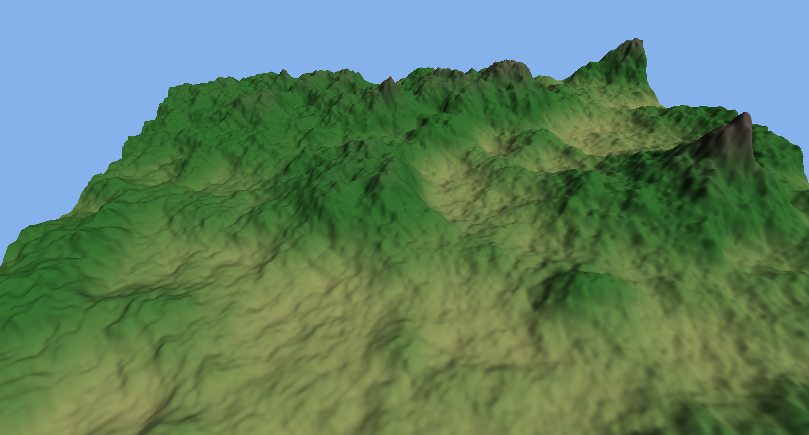

# vulkan-go

A Vulkan binding for Go built on [purego](https://github.com/ebitengine/purego).
No cgo and no C compiler. The Vulkan loader is opened at runtime with `dlopen`
and commands are resolved through `vkGetInstanceProcAddr` and
`vkGetDeviceProcAddr`, the same model [volk](https://github.com/zeux/volk) uses
in C.

Because there is no cgo:

- Builds need only the Go toolchain.
- Cross-compilation works without a cross C toolchain.
- Build and startup are fast.

## Requirements

- The Vulkan loader (`libvulkan.so.1` on Linux).
- A Vulkan-capable GPU and driver.
- For the examples: SDL3 (`libSDL3.so.0`) for windowing.
- To recompile the example shaders: `glslc` (the compiled SPIR-V is committed,
  so this is only needed if you edit the shaders).

## Install

```
go get github.com/christerso/vulkan-go
```

## Usage

```go
package main

import (
	"fmt"

	"github.com/christerso/vulkan-go/vk"
)

func main() {
	if err := vk.Load(); err != nil {
		panic(err)
	}
	instance, err := vk.CreateInstance(vk.InstanceConfig{ApplicationName: "app"})
	if err != nil {
		panic(err)
	}
	defer instance.Destroy()

	devices, _ := instance.EnumeratePhysicalDevices()
	for _, pd := range devices {
		info := pd.Info()
		fmt.Printf("%s (%s)\n", info.Name, info.Type)
	}
}
```

Run `go run ./cmd/vkinfo` to print the GPUs and create a logical device.

## Package layout

- `vk` — the binding. Handles, enums, structs, and commands, plus thin
  constructors (`CreateInstance`, `CreateSwapchain`, `CreateGraphicsPipeline`,
  command recording, buffers, memory, sync). Vulkan handles are Go types over
  `uintptr` (dispatchable) and `uint64` (non-dispatchable). Structs mirror the C
  layout; the validation layer confirms the ABI at runtime.
- `cmd/vkinfo` — minimal instance + device example.
- `examples/flythrough` — terrain flythrough with frame-time and GC measurement.

## Example: flythrough

A procedural terrain rendered with one instanced-free indexed draw, a depth
buffer, and a camera that orbits over the landscape. It measures per-frame time
and the Go garbage collector's stop-the-world pauses.

```
go run ./examples/flythrough                 # windowed, runs until closed/Escape
go run ./examples/flythrough -frames 3000 -n 768
```

Flags: `-n` grid resolution, `-frames` frame cap, `-gcload` background allocator
that forces frequent GC (on by default), `-novalidate` disable the validation
layer.



## Measured results

Hardware: Intel Arc B580 (discrete), Linux, Go 1.26.4. Numbers from the demo's
own report.

768×768 grid, 1,176,578 triangles, validation off, GC load on:

```
frames        3000 in 3.9s
avg FPS       763
frame time    avg 1.31 ms  min 0.08  p50 1.29  p99 1.49  max 11.53
GC cycles     38 (9.7/s)
STW pauses    75  total 2.06 ms
pause/frame   mean 27.5 us  max 65.5 us
```

256×256 grid, 130,050 triangles, validation on: 3362 FPS.

### Reading the GC numbers

The `-gcload` allocator runs in the background and allocates pointer-bearing
garbage continuously, which forces about ten GC cycles per second. Across those
cycles the longest stop-the-world pause was 65 microseconds. A frame at this
load takes 1.31 milliseconds, so the worst pause is about 1/20th of one frame.
The 99th-percentile frame time (1.49 ms) sits just above the average, so the GC
does not produce visible hitches.

The render loop itself allocates nothing per frame: meshes, uniforms, and
command buffers are created once and reused. The GC pressure in these numbers
comes only from the synthetic background allocator, included to show the GC
running rather than idle.

## License

MIT. See LICENSE.
